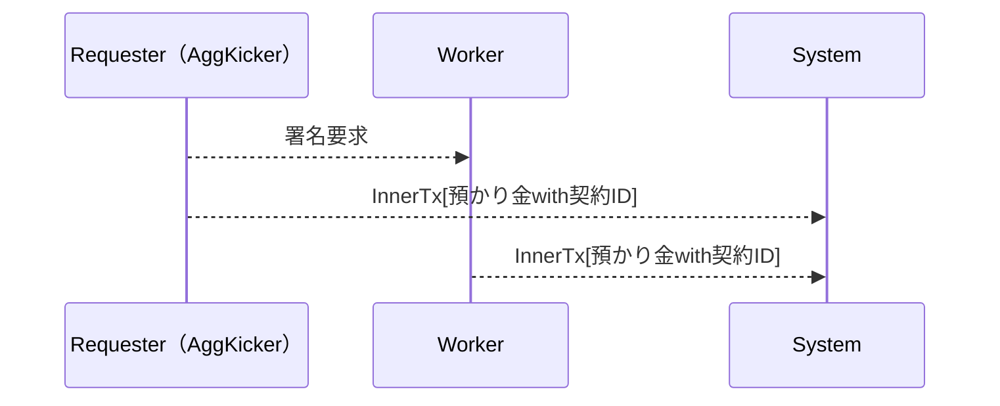
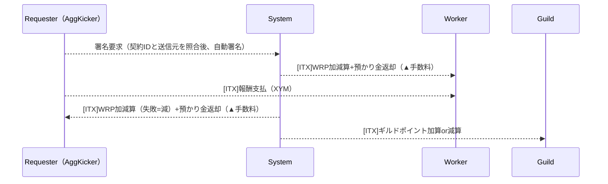
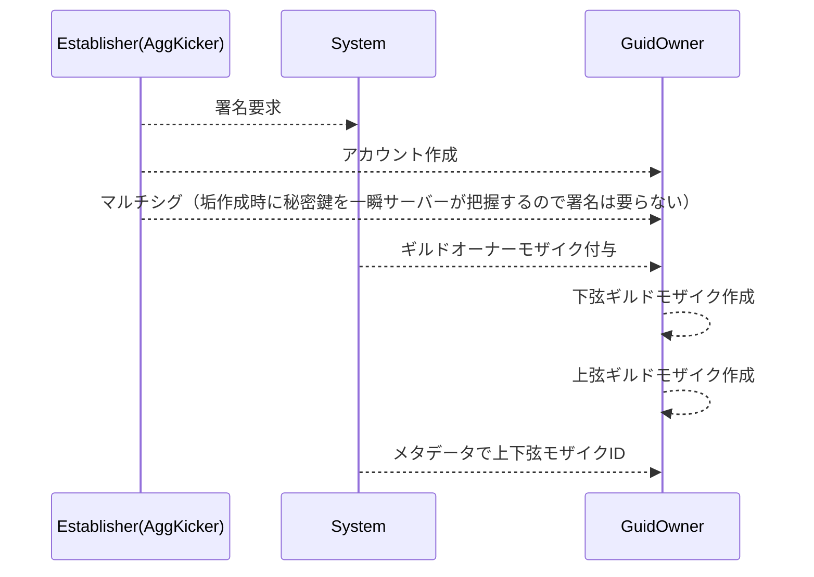
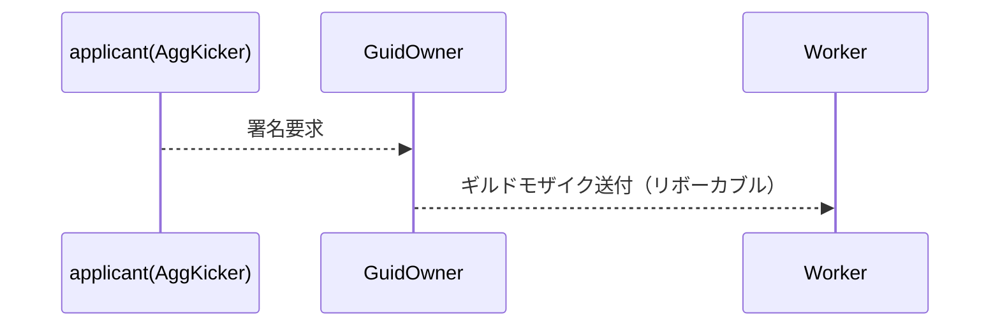
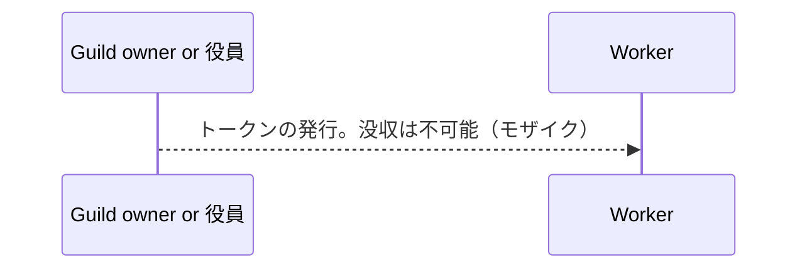

# Decentralized Guild ToDo

### 発注時コントラクトフロー

1つのコントラクト処理内で以下対応を完結する。2つの子トランザクション内で、システムが預かり金の徴収を行いつつ、どの契約IDに対する処理かをオンチェーン上に記録する（契約IDはサーバー内のDatabaseを参照。契約内容全てを記録する事も可能であるが、個人情報等を記載された場合の対応が困難である為、システム的IDのみをコントラクト側には記録を行う）。

※ 預かり金 ... イタズラ、荒らしの防止として契約成立時に一定数の資産を徴収する。契約完了時には返却する。通報があった場合ロックする。

### 納品完了時コントラクトフロー

1つのコントラクト処理内で以下対応を完結する。発注時にシステムは預かり金を得ている為、このタイミングで返却する。ただし、システムは手数料（税収）を徴収する為、この際に預かり金を減産して返却する。

### ギルド設立時コントラクトフロー

ギルドの建設時には以下のフローを行う。トークンの発行が必要であり、この処理を行う前にギルドオーナーに対して消費するトークンの明示を行い、承認があった場合、アカウントやトークンの作成が行われる。GuildOwnerアカウントは発行者のマルチシグアカウントとして構成される。Guild Ownerの変更時はマルチシグアカウントの組み替えで表現とする

※ worker ro requester が申請を行う為、Establisher = worker/requester

### ギルド加入/脱退時コントラクトフロー

ギルド加入の署名はトークンの所有により署名される。このトークンを下位トークンと呼ぶ。没収可能であり、ギルドへの加入有無のみを判別する

### ギルド内評価用ポイントコントラクトフロー

ギルド内で貢献したものに専用のトークンをオーナーより発行する。上位トークンと呼ぶ。下位トークンのみでもギルド運営は可能であるが、上位トークンには以下の意味合いを持たせる。サーバー側には記録されず、所有数はBlockchainへ照会をかけるのみとする。

1. ギルド内で貢献する価値の向上 = 上位トークンの価値向上等でギルドを育てる意義を作る
2. ギルド内での議決権を示す = 上位トークンの所有者はギルド運営に参加が可能。所有数が議決権となる

